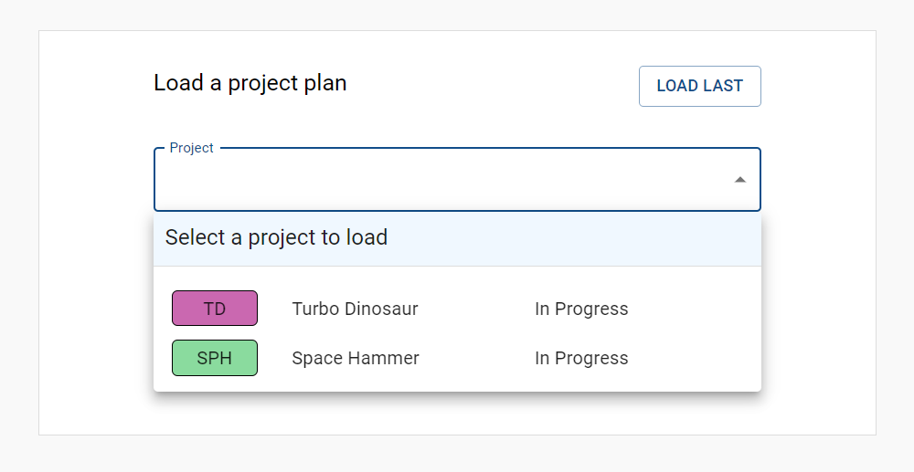
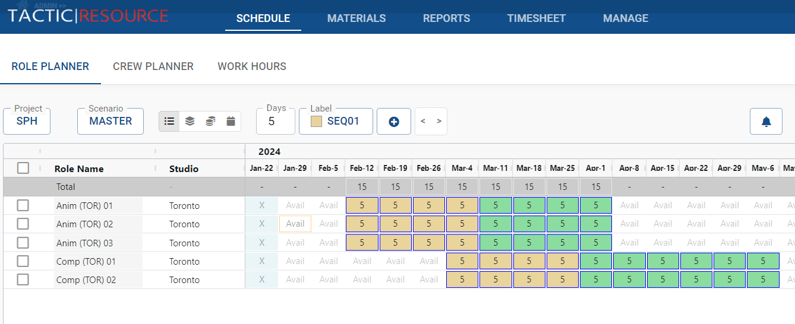
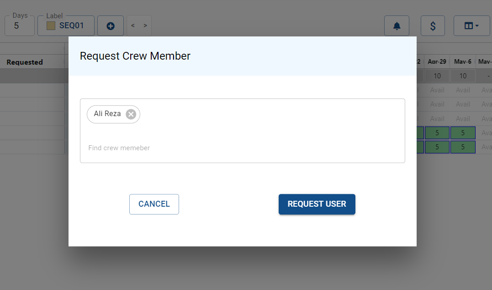
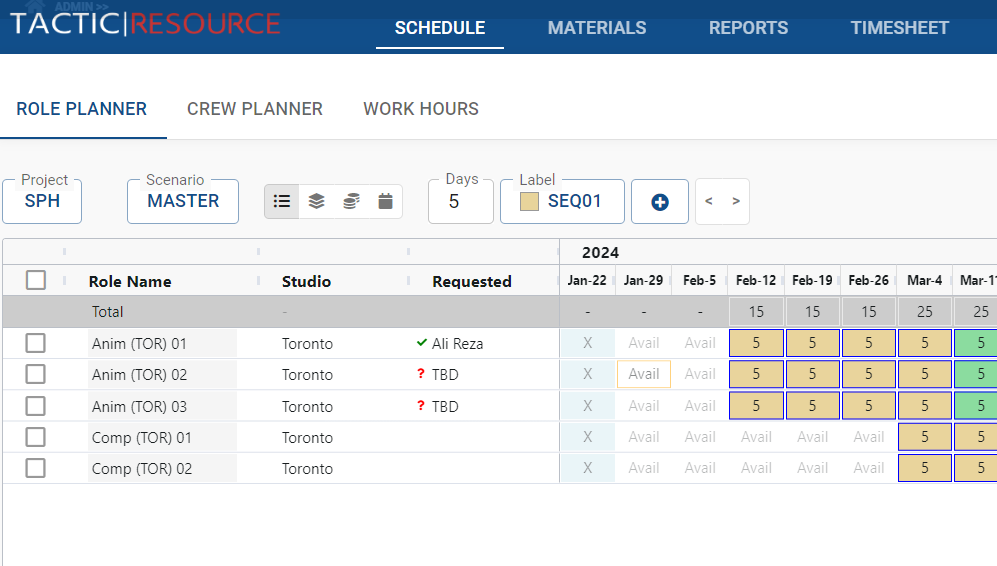

Creating a Project Schedule
===========================================
To create a schedule in the Role Planner, schedules first need to add roles to a project. Follow these steps to set up a project schedule:

By adding roles to the project schedule within the Crew Planner, schedulers can effectively define the scope and resource requirements of a project. This information serves as the foundation for managing resource allocation, capacity planning, and crew member scheduling within the Resource Manager application.

Note that this describes the process of creating a schedule from the beginning.  It is often preferable to first create a schedule in a spreadsheet and then importing the data into the role planner.  Go [here]({{ 'import_data' }}) for instructions on how to import data.

## Loading a project

Load the project for which you want to create a schedule.

{: style="width: 80%; padding: 20px"}

Begin adding roles to the project by clicking on the "Add Role" button.

## Adding a role

Define each role by specifying the type of work, the number of people required for the role, and the duration of the role within the project.

{: style="width: 80%; padding: 20px"}

For roles where specific crew members are requested, add their names to the "Requested" column to indicate the preferred personnel for those roles.

{: style="padding: 20px"}

## Selecting Cells

Within the Crew Planner's timeline, schedulers can select individual cells or blocks of cells to perform various actions. This enables efficient management of project schedules and crew member assignments.

To select a single cell, click on the desired cell within the timeline.

To select a block of cells, click on the first cell, then hold down the "Shift" key and click on the last cell in the desired range.

### Performing Actions on Selected Cells

Once the desired cells are selected, various actions can be performed on the selection, such as:

**Assigning Roles**: Allocate roles to crew members for the selected timeframes within the project schedule.

**Updating Role Information**: Modify details about the selected roles, including the number of people required or the duration of the role within the project.

**Setting Labels**: Apply labels to selected cells to categorize project sub-sections or milestones, improving schedule organization and visibility.

## Setting days

Days can be added to the cells by selecting a block of cells and clicking.

{: style="width: 40%; padding: 20px"}

When selecting the "+" button, the current days and the current label will be set on he selected cells.  Alternatively, the following hot-keys can be pressed:

**1-9**: sets the selected cells with the corresponding number of days.

**0**: sets the cell to zero days

**Up Arrow**: increment selected days by 1

**Down Arrow**: increment selected days by 1

**Delete**: sets the cell to zero days

**Enter**: sets the selected cells with the current days and the current label.

**L**: sets the selected cells with the current label.

**CTRL-Z**: undo the last operation

**CTRL-Y**: redo the last operation

## Managing Labels

Labels can help categorize project sub-sections, such as sequences or milestones, to provide better organization and visibility for project planning. Labels are customizable and can represent any desired categorization.

For more information about managing labels, navigate [here]({{ 'labels' }})

## Managing Scenarios

Scenarios represent alternative project schedules or resource allocation plans. Each scenario enables schedulers to explore different approaches to scheduling, resource distribution, and overall project planning.

For more information about managing labels, navigate [here]({{ 'scenarios' }})

## Managing a schedule

After adding roles to a project in the Role Planner, schedulers can select cells and set the days and labels to create a comprehensive project schedule.

Follow these steps to build a schedule in the Role Planner:

Select the desired cells within the Role Planner timeline. You can choose individual cells or blocks of cells using the "Shift" key to select multiple cells.

{: style="width: 100%; padding: 20px"}

Set the days for each role by adjusting the start and end dates as needed. This ensures that the project timeline accurately reflects the expected duration of each role within the project.

{: style="width: 100%; padding: 20px"}

Apply labels to the selected cells to categorize project sub-sections or milestones, such as sequences or phases. This helps improve schedule organization and visibility for all stakeholders.

{: style="width: 100%; padding: 20px"}

Continue selecting cells and setting days and labels for each role within the project, creating a detailed and organized project schedule.

## Requesting a Resource

Schedulers can request specific crew members to fill project roles. These requests serve as an indication of the desired resources for each role, even if they are not yet confirmed to fit into the crew members' schedules.

Follow these steps to request a crew member in the Role Planner:

Locate the "Requested" column within the Role Planner interface.

Double-click on the appropriate cell within the "Requested" column for the desired role and time period.  A pop-up window will appear, allowing you to type in the name of the requested crew member.

{: style="width: 100%; padding: 20px"}

As you type, a list of matching crew members will appear, from which you can select the desired person.  If the requested crew member is not yet part of the crew or is a placeholder (e.g., "TBD"), you can manually enter the text in the pop-up window.

Confirm your selection or input, and the requested crew member will be added to the cell in the "Requested" column.

{: style="width: 100%; padding: 20px"}

