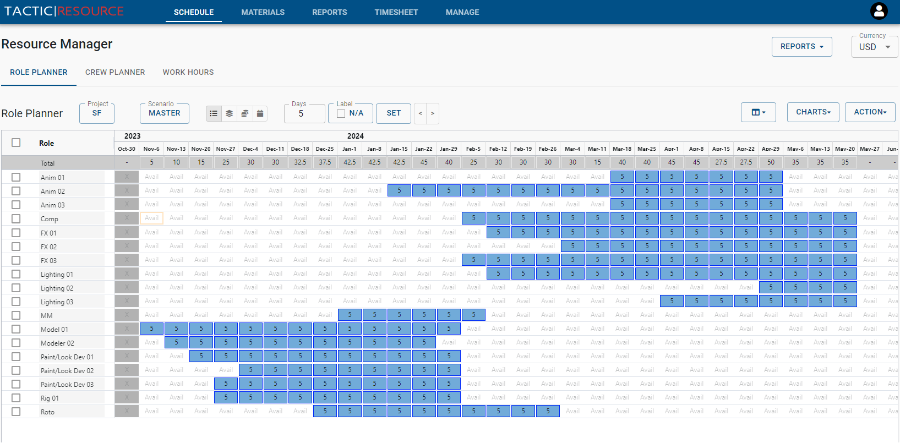

# Role Planner

The role manager allows you to create project planes using roles that you have defined in your organization.   A project plan consists of a list of roles that are require to complete a project.  Each role can lay out the number of days needed to work per week.

{: style="padding: 20px"}

The role planner is the central place for managing an individual project.  A producer can use the role planner to plan out the requires of a project, balancing out the project with both bid days and budget.  Also, as the project is crewed, the producer can use the role planner compare their plan with the actual booking of crew.

## Loading a project.

Before working on a plan, a project must be scheduled.  This is done under that "Action" menu and selecting Load Project.  Alternatively, if there is no project currently loaded, a project selector will be displayed in the center of the screen.

If the project that is loaded has no schedule yet, a window will appear where it is possible to add defined roles into the project.

## Creating a schedule

A project schedule can be created from the beginning.  When a project is first loaded, it will present

### Balancing the budget

### Balancing the bid days

## Importing a schedule

The easiest way to import roles is to copy and paste the from a spreadsheet.

## Custom columns

## Scenarios

The role planner allows for the creation of many scenarios.  There is usually a published scenario which is the official published scenario that is visiable to others.  It is also the default scenario that is loaded when loading the project.

Scenarios are other schedules within the same project.  They can be used in a variety of ways:

1. Create a new major revision of the schedule
2. Create multiple alternative scenarios of a project to determine which would be best

### Creating a scenario

### Publishing a scenario

